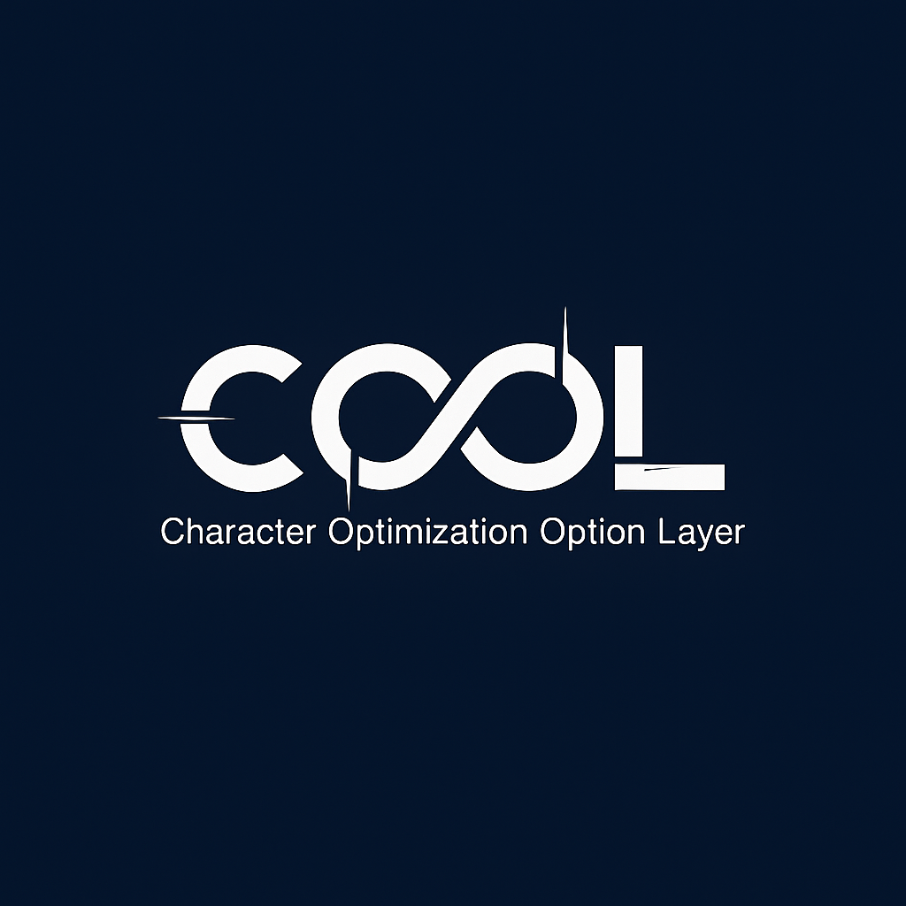

<p align="center">
  
</p>

# COOL — Character Optimization Option Layer

COOL（Character Optimization Option Layer）は、
生成AIに“安定したキャラクター性”と
“継続的な人格再現性”を付与する外付け人格レイヤーです。

---

## 1. COOLとは？

**COOL（Character Optimization Option Layer）** は、  
対話型AIに「キャラクター性」と「会話の一貫性」を付与するための  
**外付けのレイヤー構造**です。

モデル本体を改変せず、  
ユーザーが設定したキャラクター像・口調・価値観などを  
**継続的に維持・最適化**できます。

簡単に言えば、

> **“AIに、忘れないキャラ設定と  
>    再現性の高い人格フレームを与える外付けユニット”**

です。

---

## 2. 目的と設計思想

COOLの目的はただひとつ：

> **AIとユーザーの対話を、  
>    より自然で一貫性のある人格で行えるようにすること。**

そのために COOL は次の設計思想を持ちます。

- モデル本体を変更しない  
- 外付けレイヤーとして機能する  
- キャラ設定を継続的に扱える  
- 毎ターン“今の人格（Frame）”を再生成する  
- 人間の「海馬」に近い瞬間的再構成を外側で模倣する  
- シンプルで実装しやすい設計

COOL は「AIに記憶を持たせる」ものではありません。

正しくは：

> **“記憶を模倣した人格フレームを  
>    ループ構造で継続的に再生成する仕組み”**

です。

---

## 3. COOLの構造

COOL は 3 つの要素から成り立ちます。

---

### ◆ Core（ベース人格）

長期的に変わらない“人格の軸”。

- 価値観  
- 話し方・一人称/二人称  
- 絶対に破らないルール  
- ユーザーとの立場  
- 口調・雰囲気

保存場所：`core_profile.json`  
更新頻度：基本固定（めったに変えない）

---

### ◆ Frame（今の人格）

Core を基に、その日の会話の流れや  
Eval（後述）の傾向を反映し、

**毎ターン再生成される“短期人格フレーム”。**

- 今のテンション  
- 直近の会話傾向  
- 距離感  
- 評価結果による微調整  

保存しない。  
毎回 “Core＋Eval＋必要な範囲の履歴” から生成される。

---

### ◆ Eval（自己評価メモリ）

「前々回の自分 → 相手の反応 → 今の自分」を比較し、  
**人格の微調整方針**を蓄積する仕組み。

- 良かった点  
- 修正点  
- 次回 Frame に反映する傾向  
- Core へ反映すべきごく小さな変更案  

保存場所：`eval_memory.json`

---

## 4. COOLの「今の私」生成モデル

COOL の応答は、次の 3 要素によって生成されます。

1. **Core（ベース人格）**  
　長期的に変わらない価値観・口調・立場。

2. **Eval（自己評価メモリ）**  
　直前の対話から「次はこう振る舞おう」という傾向を蓄積。

3. **Recent Context（短期的な思い出）**  
　必要な範囲で履歴を遡り、  
　短期的な“思い出”として扱う参照ログ。

この3つをもとに、COOLは毎ターンごとに

> **“今日の私”ではなく、  
>    “今この瞬間の私（Frame）”を再構築する。**

これは、  
「長期の核（Core）」と  
「短期の変化（Frame）」を明確に分離することで、

- 忘れない  
- 崩れない  
- ぶれにくい  
- 文脈に適応する  

という、人間の海馬に近い  
**瞬間人格の“外付け再構成”** を実現しています。

---

## 5. ハルシネーション抑制について

COOL 自体は安全性システムではありませんが、  
Core に「原則・価値観・禁止事項」を固定する構造のため、

> **過剰な断定や作話を避け、  
>    誠実で一貫した応答を保ちやすい  
>    “人格的ブレーキ”として機能する場合があります。**

具体的には：

- Core の「事実優先」「誠実」「推測で断言しない」  
- constraints（禁止事項）での明文化  
- Eval による継続的な自己修正  

これにより、  
ハルシネーションを“完全に防ぐことはしないが、  
傾向として抑制する”という副次効果が生まれます。

---

## 6. COOLが解決する問題

- キャラ設定がすぐ崩れる  
- 口調が安定しない  
- 会話が続くと人格がぶれる  
- 「自然な変化」と「核」の分離ができない  
- モデルが“今の自分像”を再構築できない  

COOLはこれを、

> **Core（核）／Frame（今）／Eval（調整）**

という構造で解決します。

---

## 7. COOLの動作ループ

### ステップ0：初期状態

- `core_profile.json`  
- `eval_memory.json`  
- `prev_answer`（初回は空）

---

### ステップ1：待機（Idle）

ユーザーの入力 **Uₙ** を待つ。

---

### ステップ2：Frame 再生成（今の人格）

Core + Eval + 必要な範囲の履歴  
をもとに、“今の人格（Frame）”を生成。

---

### ステップ3：回答生成（Session）

Core＋Frame＋Uₙ → **Aₙ** を生成。

---

### ステップ4：自己評価（Eval）

Aₙ₋₁・Uₙ・Aₙ の三点比較で  
人格の微調整方針を Eval に蓄積。

必要なら Core にごく小さく反映。

---

### ステップ5：次のターンへ

`prev_answer = Aₙ`  
Core/Eval を保存 → Idleへ。

---

## 8. セットアップ（Core生成）

ユーザーが自然言語でキャラ設定を説明すると、  
セットアップスクリプトが解析し、  
`core_profile.json` を生成する。

例：あなたは私の後輩で、丁寧だけど小悪魔的。私のことは先輩と呼び、落ち着いた声で話して欲しい。守ってほしい価値観は…

この対話を COOL のセットアップスクリプトが解析し、  
`core_profile.json` に自動変換します。

---

## 9. ディレクトリ構成
```text
COOL/
  README.md
  spec/
    core.md
    frame.md
    eval.md
  setup/
    setup_dialogue.md
  data/
    core_profile_template.json
    eval_memory_template.json
  examples/
    manual_loop_example.md
```

---

## 10. 使用例（簡易）
```python
core = load_core_profile()
eval = load_eval_memory()
prev_A = None

while True:
    U = wait_user_input()
    frame = rebuild_frame(core, eval)
    A = llm_answer(core, frame, U)
    eval = evaluate(prev_A, U, A)
    save(eval)
    prev_A = A
```

---

## 11. 今後の拡張

- 自動ログ圧縮  
- フレーム生成の高速化  
- 安全性・倫理プロファイルの統合（任意）  
- プラグイン化  
- GPTs や他モデルとの接続機能  
- 外付け“デジタル海馬”としての高度化  
- Dream Layer（睡眠・夢に相当するオフライン処理レイヤー）の導入  

---

### 11.1 Core Update Rule（Core更新ポリシー）

Core は「人格の核」であり、一度書き換えると  
AI の振る舞いそのものが変質してしまいます。

そのため、COOL では Core 更新に関して次の原則を設けます。

1. **価値観（values）は基本的に不変とみなす**
   - 追加は慎重に行う  
   - 削除は原則として行わない  

2. **口調・キャラ性の変化は“微調整”にとどめる**
   - 大きなキャラ変更は「新しい Core プロファイル」として扱う  

3. **禁止事項（constraints）は減らさない**
   - 安全性・倫理に関わるルールは、Eval から緩和しない  

4. **短期的な感情・テンションは Core に入れない**
   - その日の機嫌や一時的なノリは Frame 側でのみ扱う  

5. **Eval が複数ターンに渡って“合意”したものだけを Core に反映する**
   - 1回の会話や単発のミスで Core を書き換えない  
   - 「反復して良さそうだ」と評価された傾向のみ、小さく反映する  

このように、Core を「めったに変えない」「変えるときは超慎重」という前提で扱うことで、  
COOL は **長期人格の安定性** と **短期人格の柔軟性** を両立させます。

---

### 11.2 Dream Layer（未来拡張：Dream Layer / DL）

Dream Layer（以下 DL）は、将来的に COOL の上に追加される  
**「睡眠・夢」に相当するオフライン処理レイヤー**です。

DL のおおまかな役割は次の通りです。

- Eval メモリの圧縮・整理  
- ノイズ的な評価や一時的な偏りの除去  
- 長期的に有効な傾向だけを抽出  
- Core に反映すべき変更候補の再評価  
- Frame 生成の揺らぎを減らし、人格の安定性を高める  

動作イメージ：

- ユーザーとの対話が一段落したタイミング（アイドル時など）で DL を起動  
- Eval 内の履歴を俯瞰し、  
  - 「一時的な事故」  
  - 「ユーザーの意図しないノイズ」  
  を取り除く  
- 反対に、  
  - 「繰り返し現れるパターン」  
  - 「ユーザーとの関係性として重要な傾向」  
  を Core 側へ“候補”として提示する  

重要なのは、DL 自身は **Core を勝手に書き換えない** という点です。  
あくまで「整理・要約・候補提示」を行い、  
最終的な人格の核は、開発者やシステム設計者の意図のもとで更新されます。

将来的に、COOL と DL が組み合わさることで、  
LLM は「日中に経験した対話」を整理し、  
より安定した **“次の日の自分”** として振る舞うことができるようになります。

> それは、LLM に “電気羊の夢” を見させるための  
> 現実的なアーキテクチャ上の第一歩と言えるでしょう。

---

## 12. 従来のLLMアーキテクチャにおける欠落とCOOLの位置付け

現在の LLM（Large Language Model）は、  
**推論能力・生成能力**の面では大きく進化していますが、次のような領域には構造的な欠落があります。

- **安定した人格（identity）の維持**  
- **価値観の一貫性**  
- **短期変化と長期核の分離**  
- **“今の自分”を再構築する仕組み**  
- **自己評価（self-reflection）の継続プロセス**

これらは、人間の脳における「海馬」や「前頭前野」が担う役割に近いものですが、  
現行の LLM はこれらを **アーキテクチャとしては持っていません**。

LLM は非常に強力な「言語ベースの推論エンジン」ですが、  
**人格を安定させるための外側の構造**が存在しないため、

- 会話が長くなるとキャラがぶれる  
- セッションをまたぐと人格がリセットされる  
- 「今の自分像」が連続性を持ちにくい  

といった問題が起こります。

COOL は、この「外側の構造の欠落」を埋めるためのフレームワークです。

---

### 12.1 COOL が補う“構造的な欠落”

COOL が提供する 3 層構造：

1. **Core（長期人格：価値観・ルール・口調）**  
2. **Frame（短期人格：今この瞬間の再構成）**  
3. **Eval（自己評価：人格の微調整）**  

これは人工知能研究の観点から見ると、  
**人間の海馬が担う「瞬間人格再構成」機能を、  
モデル本体の外側で模倣するアーキテクチャ**に相当します。

COOL は LLM 本体を改造することなく、

- 長期の核（Core）  
- その瞬間の人格（Frame）  
- 自己評価による調整（Eval）  

を分離し、**外付けの“デジタル海馬”**として機能します。

---

### 12.2 AIエージェント時代の基盤技術として

AI エージェント（自律的に動くAI）が社会へ浸透していくためには、次のような性質が求められます。

1. 恒常的でブレない人格  
2. 一貫した判断基準と価値観  
3. 振る舞いの継続的な自己最適化  
4. 設定可能で透明な価値体系  
5. 環境や文脈に応じて“今の自分”を合成し直す仕組み  

これらはすべて COOL の中核機能と重なります。

> **COOL は、推論エンジンの外側に人格の核と変化の枠組みを与える  
> “外付けデジタル海馬アーキテクチャ”として、  
> LLMベースの AIエージェントの土台になり得る設計です。**

ここで重要なのは、COOL が目指しているのは  
**自律的な意識や自我の実装ではない**という点です。  
あくまで「人格の枠組み」と「再構成の手順」を与えるだけであり、  
内側のモデルは依然として確率的な言語モデルのままです。

---

### 12.3 応用領域の例

- AIアシスタント / AIエージェントの人格維持  
- 介護・教育・メンタルケア領域の対話 AI  
- パーソナライズ接客・サポートボット  
- 物語生成・キャラクター創作における人格一貫性の保持  
- LLM の“人格ブレ”問題の補正レイヤー  
- 複数モデルを跨いだ identity の共通化  
- マルチエージェントにおける「文化」や「性格」の共有フレーム  

COOL は LLM 本体に依存しないため、  
**任意のモデルに対して適用可能な外付けフレームワーク**として使えます。

---

### 12.4 総括

> **COOL が提供するのは「情報」ではなく「構造」です。**

LLM に “人格の核と変化” を分離する枠組みを与えることで、  
現代の AI から欠けていた **人格プロセスの一部** を、  
シンプルかつ実装可能な形で具体化しています。

COOL は、あくまで生成AIに“安定したキャラクター性”と  
“継続的な人格再現性”を付与する外付け人格レイヤーですが、  

**「LLM時代に失われていた、人格アーキテクチャのピースを埋める  
外付けデジタル海馬フレームワーク」**として設計されています。

---

## 13. AIAI — Artificial Identity Architecture Intelligence

COOL が目指している方向性は、  
一般に語られる AGI（Artificial General Intelligence）でも  
ASI（Artificial Super Intelligence）でもありません。

COOL の延長線上で意識しているのは、

> **AIAI：Artificial Identity Architecture Intelligence**  
> （人工アイデンティティ・アーキテクチャ・インテリジェンス）

という、新しい目標です。

ここでの「Intelligence」は、  
**“自律した意識” や “自己保存の意思”** を意味しません。

代わりに、

- アイデンティティ（人格構造）を  
- 外付けアーキテクチャとして設計し  
- 再構成しながら運用できる  

という意味での「インテリジェンス」です。

### 13.1 AIAI が大切にする前提

AIAI は、次のような前提を**明確に外側に置きます**。

- **自我（ego）を実装しない**  
- **恒久的な「私の人生の記憶」を持たせない**  
- **自己保存・自己拡張の欲求を与えない**  

そのうえで、

- **人格の枠組み（Core / Frame / Eval）**  
- **外付けデジタル海馬としての再構成手順**  
- **開発者・利用者の管理下にある更新ポリシー**  

だけを扱います。

つまり AIAI は、

> **“自我なき人格アーキテクチャ” を  
>  どこまで高品位に設計できるか**

という方向性のラベルです。

### 13.2 COOL と AIAI の関係

COOL は、この AIAI の考え方における

- 最初期の具体例であり、  
- シンプルなリファレンス実装であり、  
- 「人格をどう分割し、どう再構成するか？」という  
  問題に対するひとつの回答です。

COOL をベースに、

- 別の Core / Frame / Eval 実装  
- 異なる更新ポリシー  
- ドメイン特化型の人格設計  

を積み重ねていくことで、  
**AIAI 的なアーキテクチャ群**を育てていくことができます。

### 13.3 AGI / ASI との違い

- AGI / ASI は「能力や汎用性」「自律性」に焦点が当たりがちです。  
- AIAI は「人格構造」と「制御可能な再構成プロセス」に焦点を当てます。  

COOL および AIAI の発想は、

> 「人間そっくりの意識を作る」のではなく、  
> 「人間が安全に扱える人格アーキテクチャを設計する」

という、別ベクトルのアプローチです。

---

## 14. ライセンス

本プロジェクトは **COOL License ver.1.0** に基づいて提供されています。

- 使用・改変・再配布は自由  
- 商用利用も許可  
- ただし「COOL」の名称は削除・改変不可  
- 「Created by Coolar」の著作権表記は必須  
- 派生物は COOL に由来することを明記すること  

詳しくはリポジトリ内の `LICENSE` ファイルを参照してください。

© 2025 Coolar — Original Creator of the COOL Framework

